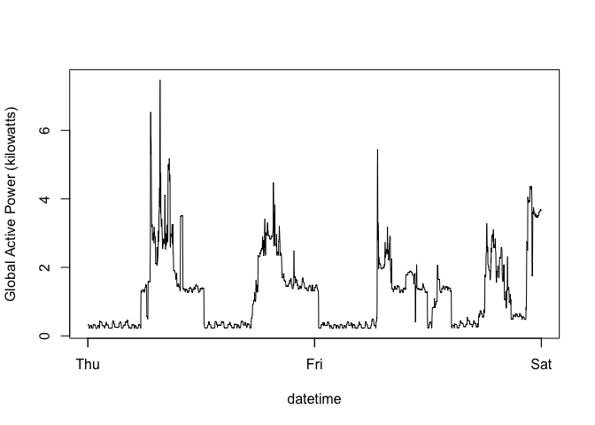
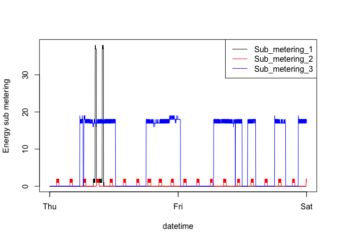
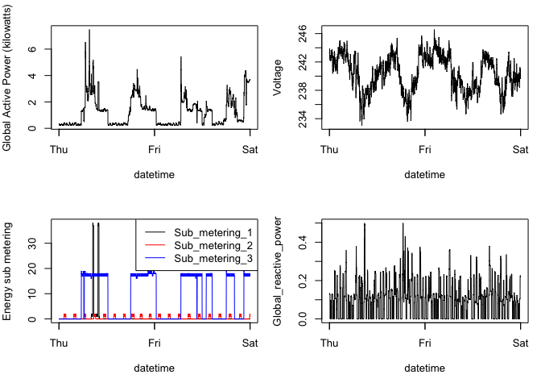

README
================

##### Project Requirement
```{r init, echo = TRUE}
Here is the code I used to create the plots.
household_power = read.table(paste0(path,"household_power_consumption.txt"),
                             header = TRUE, 
                             na.strings = "NA", 
                             sep = ";",
                             dec = ".",
                             stringsAsFactors = FALSE)
household_power = mutate(household_power,
                         datetime = dmy_hms(paste(household_power$Date,household_power$Time)))
household_power = mutate(household_power,Date = dmy(household_power$Date))
household_power = filter(household_power,Date == "2007-02-01" | Date == "2007-02-02")

for(i in 3:9){
        household_power[,i] = as.numeric(household_power[,i])}
width = 480
height = 480
```
##### Plot 1: Histogram for Global Active Power

``` r
hist(household_power$Global_active_power,
     col = "red", 
     main = "Global Active Power",
     xlab = "Global Active Power (kilowatts)",
     ylim = c(0,1200))
```
#####Save plot as a .png
```{r plot12, echo = FALSE}
dev.copy(png, file = "plot1.png",width = width, height = height)
## Don't forget to close the PNG device!
dev.off()
##### Plot 2: Global Active Power Line Graph

``` r
with(household_power,plot(datetime,Global_active_power, type = "l",
                                ylab = "Global Active Power (kilowatts)"))
```

 \#\#\#\#Plot 3: Sub\_metering Line Graph

``` r
with(household_power,plot(datetime,Sub_metering_1,type = "l",
                                ylab = "Energy sub metering"))
with(household_power,lines(datetime,Sub_metering_2, col = "red"))
with(household_power,lines(datetime,Sub_metering_3, col = "blue"))
legend("topright", lty = 1, col = c("black", "red","blue"), legend = c("Sub_metering_1","Sub_metering_2","Sub_metering_3"))
```

 \#\#\#\#Plot 4: Multiple Charts

``` r
par(mfrow = c(2, 2), mar = c(5, 4, 2, 1))
###global active power line plot
with(household_power,plot(datetime,Global_active_power, type = "l",
                          ylab = "Global Active Power (kilowatts)"))

##Voltage line plot
with(household_power,plot(datetime,Voltage,type = "l",
                          ylab = "Voltage"))
###sub_metering plot
with(household_power,plot(datetime,Sub_metering_1,type = "l",
                                ylab = "Energy sub metering"))
with(household_power,lines(datetime,Sub_metering_2, col = "red"))
with(household_power,lines(datetime,Sub_metering_3, col = "blue"))
legend("topright", lty = 1, col = c("black", "red","blue"), 
     legend = c("Sub_metering_1","Sub_metering_2","Sub_metering_3"))
#Global_reactive_power line plot
with(household_power,plot(datetime,Global_reactive_power,type = "l"))
```


