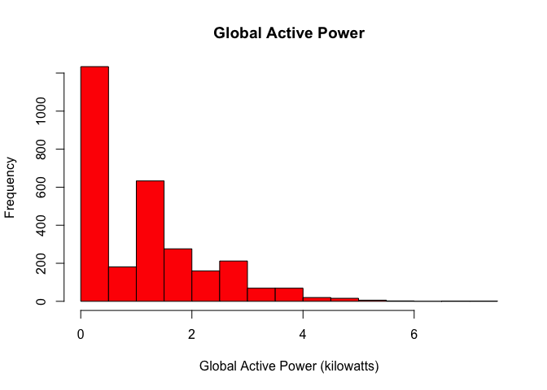

README
================

##### Project Requirement

Here is the code I used to create the plots.

    ## Warning in dir.create("./energy_use"): './energy_use' already exists

    ## Loading required package: dplyr

    ## 
    ## Attaching package: 'dplyr'

    ## The following objects are masked from 'package:stats':
    ## 
    ##     filter, lag

    ## The following objects are masked from 'package:base':
    ## 
    ##     intersect, setdiff, setequal, union

    ## Loading required package: data.table

    ## -------------------------------------------------------------------------

    ## data.table + dplyr code now lives in dtplyr.
    ## Please library(dtplyr)!

    ## -------------------------------------------------------------------------

    ## 
    ## Attaching package: 'data.table'

    ## The following objects are masked from 'package:dplyr':
    ## 
    ##     between, last

    ## Loading required package: lubridate

    ## 
    ## Attaching package: 'lubridate'

    ## The following objects are masked from 'package:data.table':
    ## 
    ##     hour, mday, month, quarter, wday, week, yday, year

    ## The following object is masked from 'package:base':
    ## 
    ##     date

##### Plot 1: Histogram for Global Active Power

``` r
hist(household_power$Global_active_power,
     col = "red", 
     main = "Global Active Power",
     xlab = "Global Active Power (kilowatts)",
     ylim = c(0,1200))
```

 \#\#\#\#\#Save plot as a .png

    ## quartz_off_screen 
    ##                 3

    ## quartz_off_screen 
    ##                 2

##### Plot 2: Global Active Power Line Graph

``` r
with(household_power,plot(datetime,Global_active_power, type = "l",
                                ylab = "Global Active Power (kilowatts)"))
```

 \#\#\#\#Plot 3: Sub\_metering Line Graph

``` r
with(household_power,plot(datetime,Sub_metering_1,type = "l",
                                ylab = "Energy sub metering"))
with(household_power,lines(datetime,Sub_metering_2, col = "red"))
with(household_power,lines(datetime,Sub_metering_3, col = "blue"))
legend("topright", lty = 1, col = c("black", "red","blue"), legend = c("Sub_metering_1","Sub_metering_2","Sub_metering_3"))
```

 \#\#\#\#Plot 4: Multiple Charts

``` r
par(mfrow = c(2, 2), mar = c(5, 4, 2, 1))
###global active power line plot
with(household_power,plot(datetime,Global_active_power, type = "l",
                          ylab = "Global Active Power (kilowatts)"))

##Voltage line plot
with(household_power,plot(datetime,Voltage,type = "l",
                          ylab = "Voltage"))
###sub_metering plot
with(household_power,plot(datetime,Sub_metering_1,type = "l",
                                ylab = "Energy sub metering"))
with(household_power,lines(datetime,Sub_metering_2, col = "red"))
with(household_power,lines(datetime,Sub_metering_3, col = "blue"))
legend("topright", lty = 1, col = c("black", "red","blue"), 
     legend = c("Sub_metering_1","Sub_metering_2","Sub_metering_3"))
#Global_reactive_power line plot
with(household_power,plot(datetime,Global_reactive_power,type = "l"))
```


